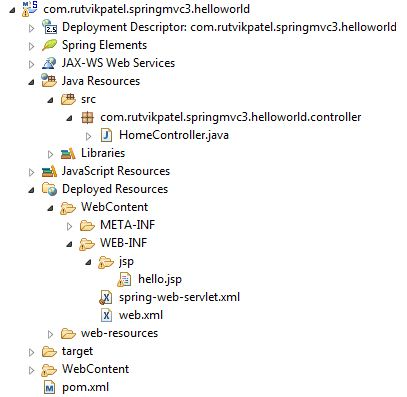
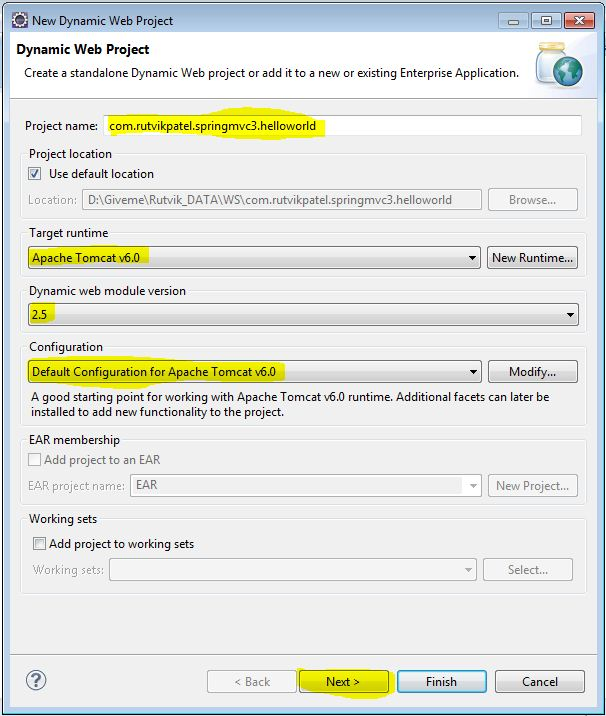
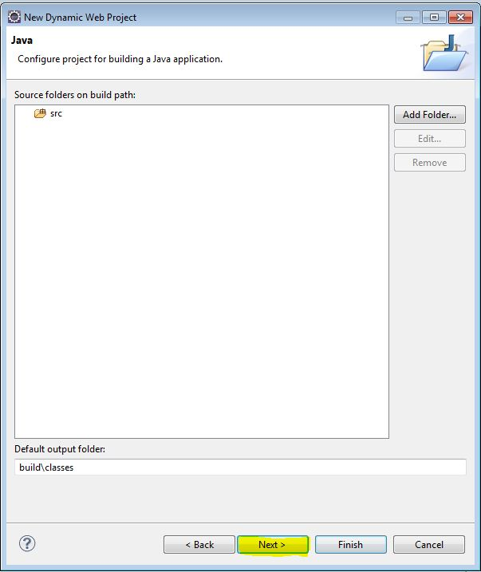
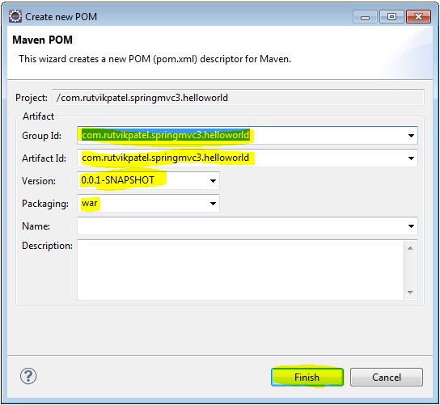
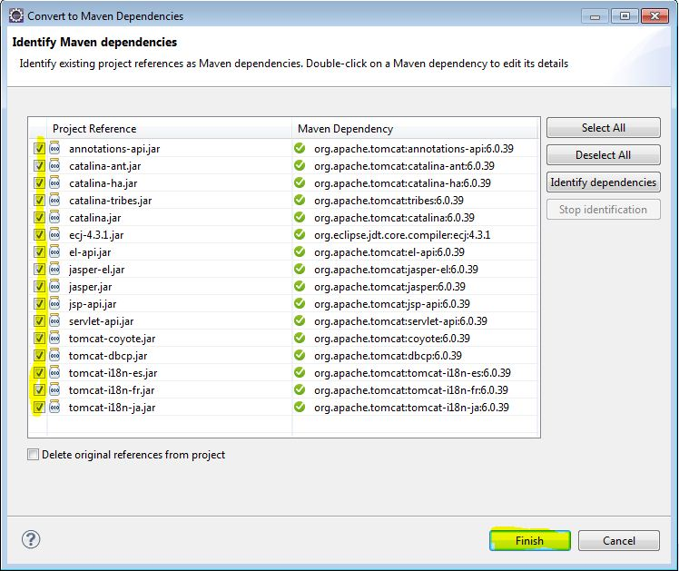
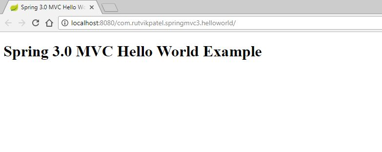
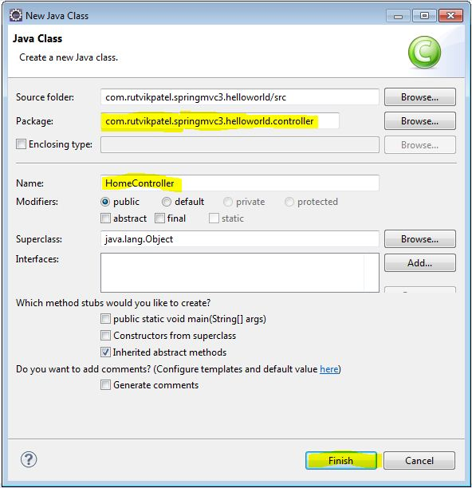

# springmvc-3-hello-world
Day 4 - Spring MVC 3.0 - Hello World Example

> In this tutorial you will know how to create Spring 3.0 MVC hello world example in simplest way.


### Project Structure




#### Step 1 - Let’s Setup Environment

1. Spring 3.2.13.RELEASE and any latest version
2. Maven 3 and any latest version
3. JDK 1.6 / JDK 1.7 / JDK 1.8 / JDK 1.9
4. Eclipse Kepler / Eclipse Juno / Eclipse Neon
5. Tomcat 6 / Tomcat 7 / Tomcat 8 / Tomcat 9

#### Step 2 - Create Project

> Click on File > New > Dynamic Web Project





#### Step 3 - Convert as Maven Project

> Click Right click on Project > Configure > Convert to Maven project





#### Step 4 - Add Dipendency in ``pom.xml`` file

```XML
<project xmlns="http://maven.apache.org/POM/4.0.0" 
	xmlns:xsi="http://www.w3.org/2001/XMLSchema-instance" 
	xsi:schemaLocation="http://maven.apache.org/POM/4.0.0 http://maven.apache.org/xsd/maven-4.0.0.xsd">
  <modelVersion>4.0.0</modelVersion>
  <groupId>com.rutvikpatel.springmvc3.helloworld</groupId>
  <artifactId>com.rutvikpatel.springmvc3.helloworld</artifactId>
  <version>0.0.1-SNAPSHOT</version>
  <packaging>war</packaging>
  
  <!-- Starts Here -->
	<properties>
		<jdk.version>1.6</jdk.version>
		<spring.version>3.2.13.RELEASE</spring.version>
		<jstl.version>1.2</jstl.version>
	</properties>
	<dependencies>
		<dependency>
			<groupId>org.springframework</groupId>
			<artifactId>spring-webmvc</artifactId>
			<version>${spring.version}</version>
		</dependency>
		<dependency>
			<groupId>javax.servlet</groupId>
			<artifactId>jstl</artifactId>
			<version>${jstl.version}</version>
		</dependency>
		<dependency>
		    <groupId>javax.servlet</groupId>
		    <artifactId>javax.servlet-api</artifactId>
		    <version>3.0.1</version>
		    <scope>provided</scope>
		</dependency>
	</dependencies>
  <!-- End Here -->
  
  <build>
    <sourceDirectory>src</sourceDirectory>
    <plugins>
      <plugin>
        <artifactId>maven-compiler-plugin</artifactId>
        <version>3.1</version>
        <configuration>
          <source>1.7</source>
          <target>1.7</target>
        </configuration>
      </plugin>
      <plugin>
        <artifactId>maven-war-plugin</artifactId>
        <version>2.3</version>
        <configuration>
          <warSourceDirectory>WebContent</warSourceDirectory>
          <failOnMissingWebXml>false</failOnMissingWebXml>
        </configuration>
      </plugin>
    </plugins>
  </build>
</project>
```


#### Step 5 - Add Spring Servlet in ``WebContent\WEB-INF\web.xml`` file

```XML
<?xml version="1.0" encoding="UTF-8"?>
<web-app xmlns:xsi="http://www.w3.org/2001/XMLSchema-instance" 
	xmlns="http://java.sun.com/xml/ns/javaee" 
	xsi:schemaLocation="http://java.sun.com/xml/ns/javaee http://java.sun.com/xml/ns/javaee/web-app_2_5.xsd" 
	id="WebApp_ID" version="2.5">
	
	<display-name>com.rutvikpatel.springmvc3.helloworld</display-name>
	
	<!-- Starts Here -->
	<servlet>
		<servlet-name>spring-web</servlet-name>
		<servlet-class>org.springframework.web.servlet.DispatcherServlet</servlet-class>
		<load-on-startup>1</load-on-startup>
	</servlet>
	
	<servlet-mapping>
		<servlet-name>spring-web</servlet-name>
		<url-pattern>/</url-pattern>
	</servlet-mapping>
	<!-- End Here -->
	
</web-app>
```


#### Step 6 - Add Spring Configration in ``WebContent\WEB-INF\spring-web-servlet.xml`` file

```XML
<!-- Start Here -->
<beans xmlns="http://www.springframework.org/schema/beans"
	xmlns:context="http://www.springframework.org/schema/context"
	xmlns:xsi="http://www.w3.org/2001/XMLSchema-instance"
	xmlns:mvc="http://www.springframework.org/schema/mvc"
	xsi:schemaLocation="
        http://www.springframework.org/schema/beans     
        http://www.springframework.org/schema/beans/spring-beans-3.2.xsd
        http://www.springframework.org/schema/mvc 
        http://www.springframework.org/schema/mvc/spring-mvc-3.2.xsd
        http://www.springframework.org/schema/context 
        http://www.springframework.org/schema/context/spring-context-3.2.xsd">
    
	<!-- component scan location configuration -->
	<context:component-scan base-package="com.rutvikpatel.springmvc3.helloworld" />
	
	<!-- jsp page binding configuration -->
	<bean class="org.springframework.web.servlet.view.InternalResourceViewResolver">
		<property name="prefix">
			<value>/WEB-INF/jsp/</value>
		</property>
		<property name="suffix">
			<value>.jsp</value>
		</property>
	</bean>
	
	<!-- static resources are in here configuration -->
	<mvc:resources mapping="/resources/**" location="/resources/" />
	
	<!-- enable spring annotation -->
	<mvc:annotation-driven />
	
</beans>
<!-- End Here -->
```


#### Step 7 - Add View to project ``WebContent\WEB-INF\jsp\hello.jsp`` file

```JSP
<%@ page language="java" contentType="text/html; charset=ISO-8859-1" pageEncoding="ISO-8859-1"%>
<%@ taglib prefix="c" uri="http://java.sun.com/jsp/jstl/core"%>

<!DOCTYPE html PUBLIC "-//W3C//DTD HTML 4.01 Transitional//EN" "http://www.w3.org/TR/html4/loose.dtd">
<html>
<head>
	<title>${title}</title>
</head>
<body>
	<h1>${title}</h1>
	
	<c:if test="${not empty name}">
		Hello ${name}
	</c:if>
</body>
</html>
```




#### Step 8 - Add Controller Class in ``src\com\rutvikpatel\springmvc3\helloworld\controller\HomeController.java`` folder

> Right Click on ``src`` folder > New > Class



```JAVA
package com.rutvikpatel.springmvc3.helloworld.controller;

import org.springframework.stereotype.Controller;
import org.springframework.ui.Model;
import org.springframework.ui.ModelMap;
import org.springframework.web.bind.annotation.PathVariable;
import org.springframework.web.bind.annotation.RequestMapping;
import org.springframework.web.bind.annotation.RequestMethod;

@Controller
public class HomeController {

	@RequestMapping(value = "/", method = RequestMethod.GET)
	public String printWelcome(ModelMap model) {
		model.addAttribute("title", "Spring 3.0 MVC Hello World Example");
		return "hello";
	}
	
	@RequestMapping(value = "/hello/{name}", method = RequestMethod.GET)
	public String hello(Model model,@PathVariable("name") String name) {
		model.addAttribute("name", name);
		model.addAttribute("title", "Spring 3.0 MVC Hello World Example");
		return "hello";
	}
}
```


# That's it... you are ready to run

> Right Click on Project > Run As > Run on Server > Select Tomcat Server and click ``finish``

### Note

> In ``spring-web-servlet.xml`` file prefix ``XXX-servlet.xml`` should be same as servlet-name described in ``web.xml`` file

```XML
<servlet>
	<servlet-name>spring-web</servlet-name>
	<servlet-class>org.springframework.web.servlet.DispatcherServlet</servlet-class>
	<load-on-startup>1</load-on-startup>
</servlet>
<servlet-mapping>
	<servlet-name>spring-web</servlet-name>
	<url-pattern>/</url-pattern>
</servlet-mapping>
```


## Meta

Rutvik Patel - rrpatel003@gmail.com

Distributed under the GPL V3.0 license. See ``LICENSE`` for more information.
